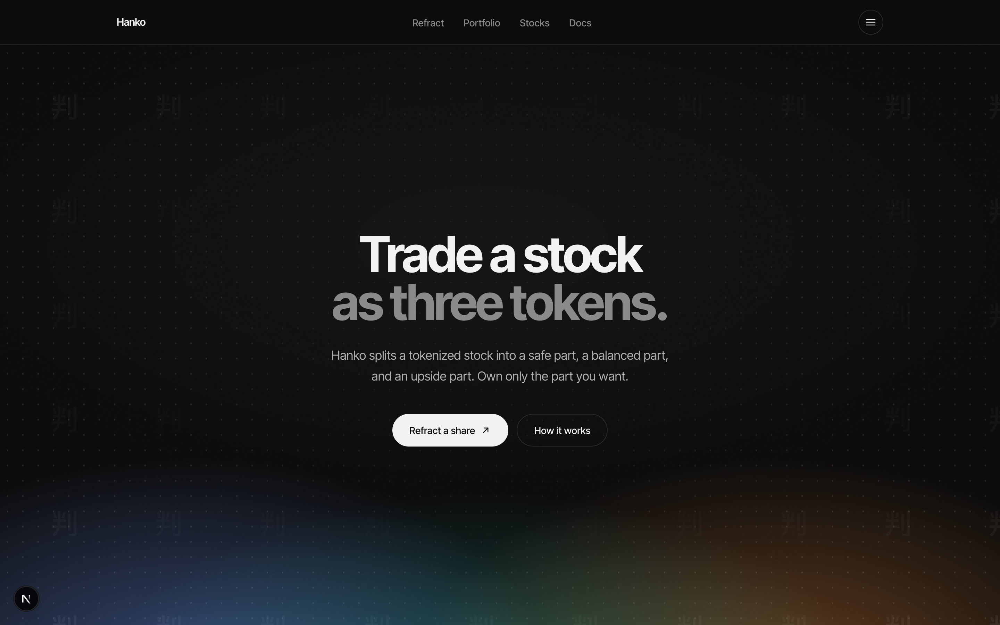
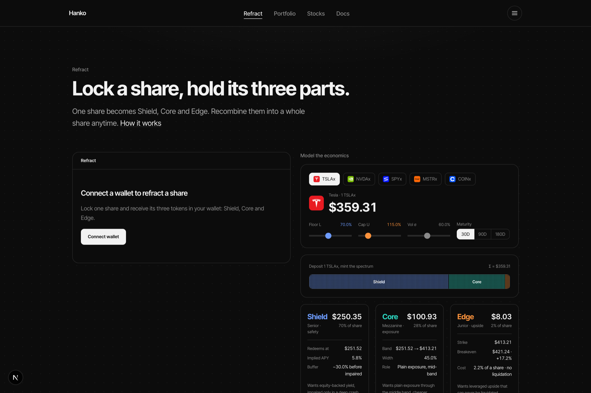
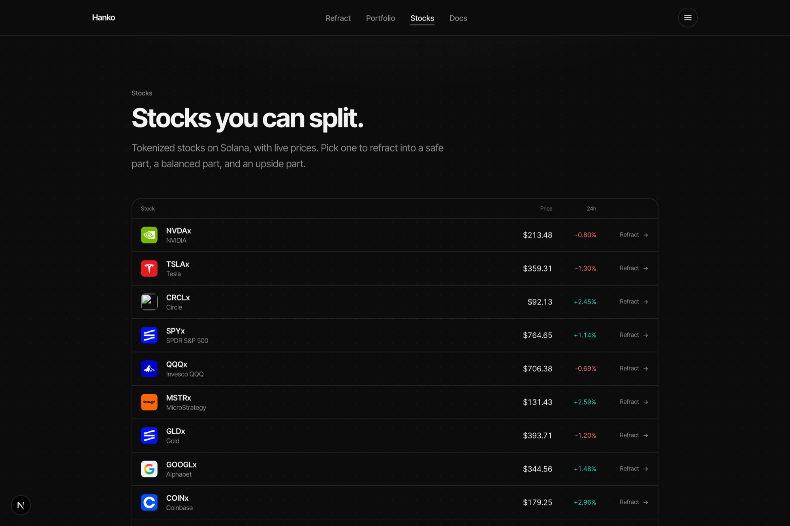

# Hanko (判子)

**Split a tokenized stock into three tradeable parts — that always recombine into one share.**

A share bundles three different things into one price: safety, exposure, and upside. Everyone is forced to buy all three at once. **Hanko** refracts one tokenized stock into three SPL tokens — **Shield**, **Core**, and **Edge** — so you can hold, buy, or sell only the part you want. Put the three back together and you get your whole share back.

Named after the seal (判子) a Japanese company presses onto a document to make it real: Hanko reads the hidden structure inside a tokenized stock, lets you separate it, and the seal is what makes each piece authentic.

🔗 **Live:** [hankolabs.xyz](https://hankolabs.xyz) · Built for the Solana Foundation **Stocklana** hackathon.



## The three parts

Deposit `1` tokenized share into the Hanko vault with a floor `L` and a cap `U`. At settlement price `S`, each unit pays out:

| Token      | Payoff                    | Who it's for                                         |
| ---------- | ------------------------- | ---------------------------------------------------- |
| **Shield** | `min(S, L)`               | The safe part — holds value unless the stock crashes through the floor |
| **Core**   | `clamp(S − L, 0, U − L)`  | The balanced part — plain exposure through the middle band |
| **Edge**   | `max(S − U, 0)`           | The upside part — leveraged upside above the cap, and it can never be liquidated |

```
Shield + Core + Edge  ≡  S        (recombine to get the share back)
```

No external capital is created — it is a fully collateralized redistribution of one share's payoff. That conservation law is exactly why it is trustless and provable, unlike the opaque OTC structured notes it replaces. By put–call parity the three tranche *values* also sum to spot, so indicative primary prices (Black–Scholes) obey the same invariant.

## Refract, model, trade

Pick a live tokenized stock, model the economics (floor / cap / vol / maturity), and watch the share refract into three priced tokens — with conservation shown on screen.



Once refracted, each part trades on its own **constant-product pool**. Buy just the Edge, sell just the Shield — no need to touch the others.



A **Portfolio** dashboard reads your holdings, each tranche's market price, and your recent on-chain activity live from devnet.

The interface is theme-aware; the hero is the spectrum itself, cool Shield up top blooming to a warm Edge glow at the bottom.

## On-chain

The Anchor program `hanko_vault` is **deployed and tested on Solana devnet**.

**Program ID:** `EjxYgyiQ6DY8qB69svz6sooP3SRo7jCECHYiEDZG1i9p`

| Instruction        | What it does                                                                 |
| ------------------ | ---------------------------------------------------------------------------- |
| `initialize_vault` | Open a market for an underlying mint; create the Shield / Core / Edge mints  |
| `deposit`          | Lock a share, mint one Shield + one Core + one Edge per unit                 |
| `recombine`        | Burn the triplet, return the whole share                                     |
| `settle`           | Record the settlement price at maturity                                      |
| `redeem`           | Burn one tranche for its intrinsic slice of the underlying                   |
| `init_pool`        | Open a constant-product pool (a tranche vs. the underlying) and seed it      |
| `swap`             | Trade one tranche on its pool — `x·y=k` with a 0.30% fee                      |

The end-to-end integration test proves the full lifecycle **and** the tranche market on devnet: `deposit → recombine → settle → redeem` conservation stays intact, and a swap's on-chain output matches the constant-product formula to the base unit while `k` grows by exactly the fee.

```bash
cd hanko_vault
anchor build
RPC_URL="<your devnet rpc>" npm test
```

## Stack

Next.js 16 (App Router) · React 19 · TypeScript · Tailwind CSS v4 · Anchor / Solana · wallet-adapter. Live prices via DexScreener (public, no key); tranche math in [`src/lib/spectrum.ts`](src/lib/spectrum.ts).

## Run locally

```bash
npm install
npm run dev
```

Create `.env.local`:

```bash
NEXT_PUBLIC_CLUSTER=devnet
NEXT_PUBLIC_RPC_URL=https://devnet.helius-rpc.com/?api-key=YOUR_KEY
```

The self-serve demo faucet (`/api/faucet`) funds a new wallet with a little devnet SOL so it can mint demo shares. It needs a funded key server-side, provided as `HANKO_FAUCET_SECRET` (a JSON array of the keypair's secret bytes); in local dev it falls back to `hanko_vault/.deployer.json`.

---

Not financial advice. A fully collateralized, provable structured-product primitive on tokenized equities.
