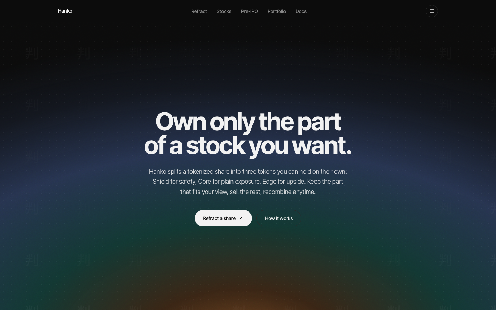
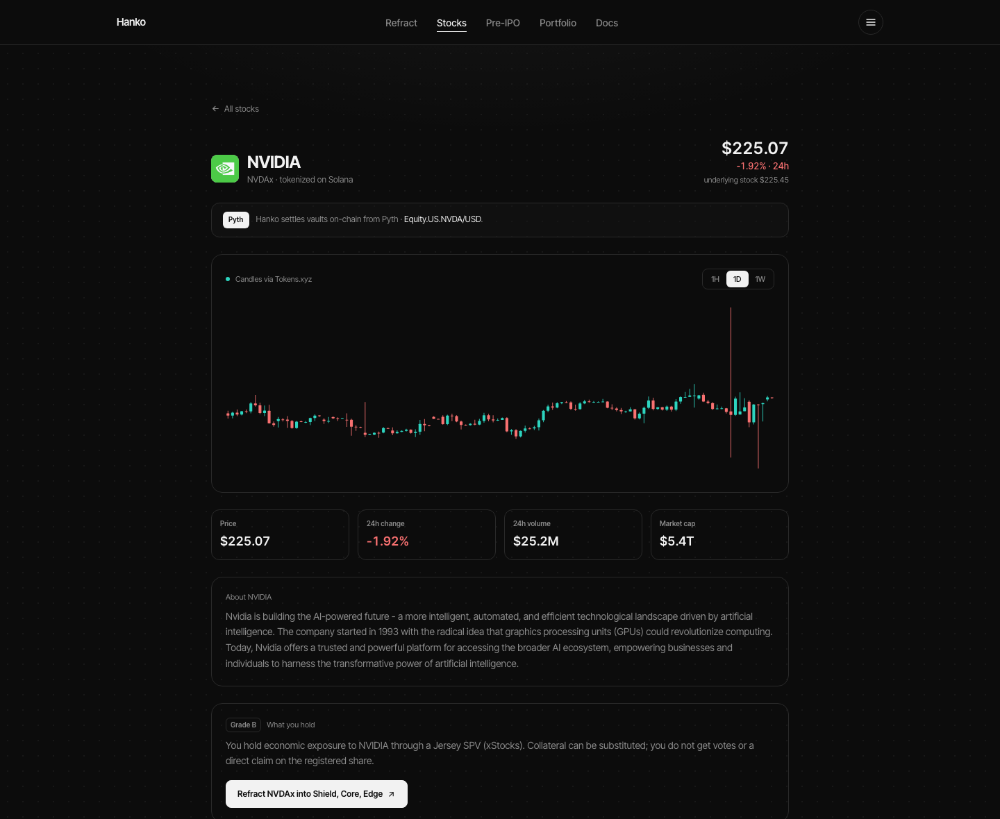
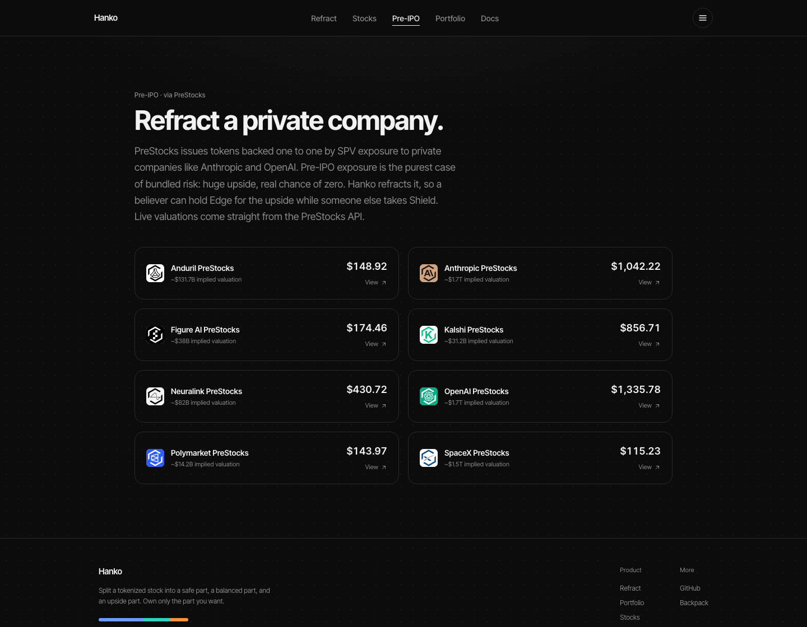

# Hanko (判子)

**Split a tokenized stock into three tradeable parts that always recombine into one share.**

A share bundles three different things into one price: safety, exposure, and upside. Everyone is forced to buy all three at once. **Hanko** refracts one tokenized stock into three SPL tokens, **Shield**, **Core**, and **Edge**, so you can hold, buy, or sell only the part you want. Put the three back together and you get your whole share back.

Three people, three appetites: the **saver** holds Shield for equity-backed yield without the swings; the **holder** takes Core for plain exposure at a cheaper entry than the whole share; the **believer** buys Edge for upside that can never be liquidated. Refract once, and each owns only the part they came for.

Named after the seal (判子) a Japanese company presses onto a document to make it real: Hanko reads the hidden structure inside a tokenized stock, lets you separate it, and the seal is what makes each piece authentic.

**Live:** [hankolabs.xyz](https://hankolabs.xyz) · Built for the Solana Foundation **Stocklana** hackathon.



## The three parts

Deposit `1` tokenized share into the Hanko vault with a floor `L` and a cap `U`. At settlement price `S`, each unit pays out:

| Token      | Payoff                    | Who it is for                                         |
| ---------- | ------------------------- | ---------------------------------------------------- |
| **Shield** | `min(S, L)`               | The safe part; holds value unless the stock crashes through the floor |
| **Core**   | `clamp(S − L, 0, U − L)`  | The balanced part; plain exposure through the middle band |
| **Edge**   | `max(S − U, 0)`           | The upside part; leveraged upside above the cap, and it can never be liquidated |

```
Shield + Core + Edge  ≡  S        (recombine to get the share back)
```

No external capital is created; it is a fully collateralized redistribution of one share's payoff. That conservation law is exactly why it is trustless and provable, unlike the opaque OTC structured notes it replaces. By put/call parity the three tranche *values* also sum to spot, so indicative primary prices (Black/Scholes) obey the same invariant.

## Refract and model any stock, or pre-IPO

Pick a stock or a pre-IPO token, model the economics (floor / cap / vol / maturity), and watch the share refract into three priced tokens, conservation shown on screen. Refract it for real and each part trades on its own **constant-product pool**: buy just the Edge, sell just the Shield, no need to touch the others.


## Live market data, and Pyth settlement

Every stock page shows a **live Pyth price** (`Equity.US.<TICKER>/USD`, the feed the vault settles from on-chain), a **real candlestick chart and market data** from Tokens.xyz, the underlying stock price next to the on-chain token price, market cap, and a company description.



## Pre-IPO, via PreStocks

Pre-IPO exposure is the purest bundled risk: enormous upside, a real chance of zero, priced as one number. Hanko refracts it. The Pre-IPO page pulls live tokens straight from the PreStocks API, each with a detail page (description, implied valuation, supply) and a refract flow, so a believer can hold Edge on OpenAI while someone else takes the safe part.



## Portfolio

A dashboard reads your holdings, each tranche's market price, a net value in shares, and your recent on-chain activity, live from devnet. Each transaction is labeled ("Refracted a share", "Traded a tranche", "Redeemed a tranche") rather than shown as a bare hash.

## Try it in 60 seconds (devnet)

On [hankolabs.xyz](https://hankolabs.xyz):

1. **Connect a wallet** (Phantom or Solflare on devnet).
2. **Mint demo shares** on `/refract`. The app funds your wallet with a little devnet SOL, then mints you 100 test shares and opens a vault.
3. **Refract** some shares into Shield, Core, and Edge.
4. **Open a market** for one part and **buy just the Edge** (or sell just the Shield).
5. Open **`/portfolio`** to see your holdings, prices, and the transactions you just made.

## On-chain

The Anchor program `hanko_vault` is **deployed and tested on Solana devnet**.

**Program ID:** `EjxYgyiQ6DY8qB69svz6sooP3SRo7jCECHYiEDZG1i9p`

| Instruction        | What it does                                                                 |
| ------------------ | ---------------------------------------------------------------------------- |
| `initialize_vault` | Open a market for an underlying mint; create the Shield / Core / Edge mints  |
| `deposit`          | Lock a share, mint one Shield + one Core + one Edge per unit                 |
| `recombine`        | Burn the triplet, return the whole share                                     |
| `settle`           | Record the settlement price at maturity                                      |
| `redeem`           | Burn one tranche for its intrinsic slice of the underlying                   |
| `init_pool`        | Open a constant-product pool (a tranche vs. the underlying) and seed it      |
| `swap`             | Trade one tranche on its pool, `x·y=k` with a 0.30% fee                      |
| `withdraw_liquidity` | Reclaim seeded pool liquidity back to the provider                         |
| `set_feed` / `settle_with_oracle` | Configure a Pyth feed, then settle permissionlessly from a signed Pyth price |

The end-to-end integration test proves the full lifecycle **and** the tranche market on devnet: `deposit → recombine → settle → redeem` conservation stays intact, and a swap's on-chain output matches the constant-product formula to the base unit while `k` grows by exactly the fee.

```bash
cd hanko_vault
anchor build
RPC_URL="<your devnet rpc>" npm test
```

## Security

A multi-agent internal [Kensho](https://github.com/cryptoduke01) self-review of every instruction is in **[docs/security-review.md](docs/security-review.md)**. Summary: no permissionless theft, drain, or freeze was found; conservation and vault solvency hold across the lifecycle; access control (signer, PDA seeds, `has_one`, ATA constraints), PDA-signed payouts, and AMM slippage bounds are all present, with `overflow-checks` on. Settlement can run permissionlessly from a Pyth pull oracle (`settle_with_oracle`, with confidence + staleness checks). The remaining production-hardening items are trust/design, not permissionless bugs: a vault with a feed can still be settled by the authority (mainnet should make the oracle authoritative), and pools are single-provider (add LP-token accounting for public multi-LP markets). Devnet demo uses freely mintable test shares.

## Repo layout

```
hanko/
├─ src/                      Next.js app (App Router)
│  ├─ app/                   routes: /, /refract, /assets/[slug], /prestocks/[symbol], /portfolio, /docs
│  ├─ components/            UI (RefractConsole, TrancheMarket, Portfolio, SplitExplainer, ...)
│  └─ lib/
│     ├─ hanko/client.ts     program client: deposit, recombine, swap, fetch balances/pools/activity
│     └─ spectrum.ts         tranche payoff + Black/Scholes pricing math
├─ hanko_vault/              Anchor workspace
│  ├─ programs/hanko_vault/  the on-chain program (one file per instruction)
│  └─ tests/hanko_vault.ts   end-to-end lifecycle + market test
└─ docs/                     screenshots + security review
```

## Stack

Next.js 16 (App Router) · React 19 · TypeScript · Tailwind CSS v4 · Anchor / Solana · wallet-adapter. Live data: **Pyth** (on-chain settlement + Pyth Pro live prices), **Tokens.xyz** (candlestick charts + market data), **PreStocks** (pre-IPO tokens), with DexScreener as a fallback. Tranche math in [`src/lib/spectrum.ts`](src/lib/spectrum.ts).

## Run locally

```bash
npm install
npm run dev
```

Create `.env.local`:

```bash
NEXT_PUBLIC_CLUSTER=devnet
NEXT_PUBLIC_RPC_URL=https://devnet.helius-rpc.com/?api-key=YOUR_KEY
# optional, server-side only (the app degrades gracefully without them):
TOKENS_XYZ_API_KEY=...   # real candlestick charts + market data
PYTH_API_KEY=...         # live Pyth prices (free at pythdata.app)
```

The self-serve demo faucet (`/api/faucet`) funds a new wallet with a little devnet SOL so it can mint demo shares. It needs a funded key server-side, provided as `HANKO_FAUCET_SECRET` (a JSON array of the keypair's secret bytes); in local dev it falls back to `hanko_vault/.deployer.json`. See [`.env.example`](.env.example) for the full list.

---

Not financial advice. A fully collateralized, provable structured-product primitive on tokenized equities.
